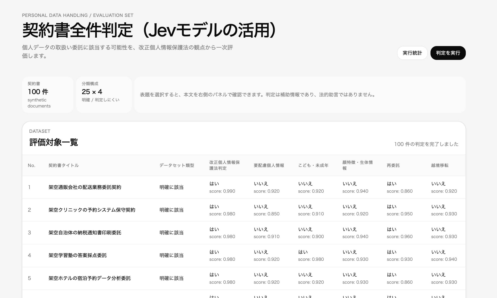

# 契約書の個人データ取扱い委託スクリーナー

契約書に関するタスクでJEVの実力を試してみる。

`data/` 配下の契約書はすべて本評価用に作成した合成データであり、実在の契約書・人物・組織・個人情報を含みません。

Jev の Noul を用いて、契約書が個人データの取扱いの委託に当たるかを一次スクリーニングする CLI です。法的助言を行うものではなく、人間レビューへ回す契約書を振り分けるための補助ツールです。

Noul は自由文を生成せず、各論点への「はい」の確率を返します。この実装では、委託該当性と5つのリスク属性を1回の API 呼び出しで評価し、確率から JSON の最終結果をコードで決定します。

## ブラウザ画面



合計100件の架空契約書（明確な該当・非該当、実際の結論が異なる判定しにくい契約書を各25件）を一覧・評価する画面を用意しています。初期表示ではNo.とタイトルだけを表示し、タイトルを選ぶと本文が右側から開きます。

次のコマンドでFastAPIと静的フロントエンドを同時に起動します。

```bash
process-compose up
```

- 画面: <http://127.0.0.1:5173>
- API: <http://127.0.0.1:8000>
- API仕様: <http://127.0.0.1:8000/docs>

「判定を実行」は最大12件ずつ並列に既存のJev判定を実行します。終了後に「実行統計」を選ぶと、API応答が報告したinput token数、総実行時間、Jev input料金（$0.042 / 100万token、1 USD = 160円）を表示します。APIがtoken数を報告しない場合、料金を推定表示しません。

## セットアップ

`.env` に API キーを設定します。

```dotenv
TYPESAFE_API_KEY=...
```

依存関係を同期します。

```bash
uv sync
```

## 実行

契約書ファイルを指定すると、標準出力に JSON だけを出力します。

```bash
uv run python -m contract_screening examples/clear_entrustment.md
```

用意した3通の契約書をまとめて判定する場合は、次を実行します。

```bash
uv run python -m contract_screening --examples
```

| ファイル | 想定する正解 | 目的 |
| --- | --- | --- |
| `examples/clear_entrustment.md` | 該当 | 個人データの処理、要配慮個人情報、再委託および越境移転を明示した例 |
| `examples/clear_non_entrustment.md` | 非該当 | 個人データが業務に介在しない物品売買の例 |
| `examples/ambiguous_non_entrustment.md` | 非該当 | 顧客傾向を扱うが、100人以上の集計済みデータのみを扱う例 |

## 判定ポリシー

- `is_personal_data_entrustment` は、委託該当性 Noul が `0.5` 以上なら `true` とします。
- `confidence` は、採用した結論の確率です。該当なら Noul 値、非該当なら `1 - Noul 値` です。
- リスク属性は、委託該当と判断された場合にだけ Noul 値 `0.5` 以上を `true` とします。
- `requires_human_review` は、`confidence < 0.9` またはいずれかのリスク属性が `true` なら必ず `true` です。
- `matched_keywords` は、生成結果ではなく、契約書本文の定型語をコードで抽出した監査用の補助情報です。

## テスト

```bash
uv run pytest
```
